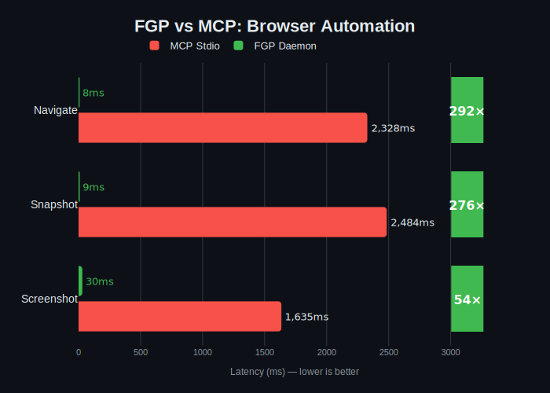
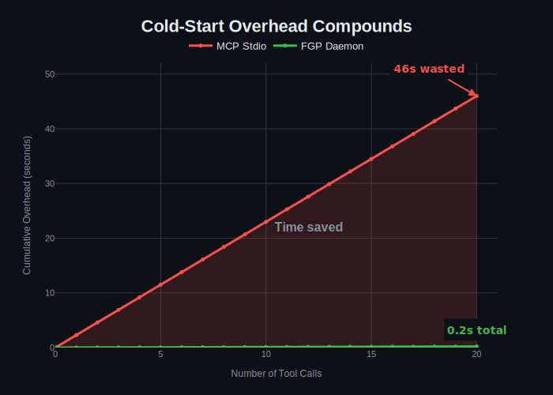

# FGP - Fast Gateway Protocol

[](https://github.com/fast-gateway-protocol/fgp/actions/workflows/ci.yml)
[](https://fast-gateway-protocol.github.io/fgp/)
[](https://opensource.org/licenses/MIT)
[](https://www.rust-lang.org/)

**Daemon-based architecture for AI agent tools. 19x faster than MCP stdio.**

FGP replaces slow MCP stdio servers with persistent UNIX socket daemons. Instead of spawning a new process for each tool call (~2.3s overhead), FGP keeps daemons warm and ready (~10-50ms latency).

This repo is the umbrella docs/meta repo. Service implementations and tools live in separate repositories under the Fast Gateway Protocol org.

## Performance

<p align="center">
  
</p>

### Browser Automation (vs Playwright MCP)

| Operation | FGP Browser | Playwright MCP | Speedup |
|-----------|-------------|----------------|---------|
| Navigate  | **8ms**     | 2,328ms        | **292x** |
| Snapshot  | **9ms**     | 2,484ms        | **276x** |
| Screenshot| **30ms**    | 1,635ms        | **54x** |

### Multi-Step Workflow Benchmark

4-step workflow: Navigate → Snapshot → Click → Snapshot

| Tool | Total Time | vs MCP |
|------|------------|--------|
| **FGP Browser** | **585ms** | **19x faster** |
| Vercel agent-browser | 733ms | 15x faster |
| Playwright MCP | 11,211ms | baseline |

### API Daemons

All methods tested at **100% success rate** (3 iterations each):

#### Gmail Daemon (PyO3 + Google API)

| Method | Mean | Min | Max | Payload |
|--------|------|-----|-----|---------|
| inbox | 881ms | 743ms | 1092ms | 2.4KB |
| search | 748ms | 680ms | 874ms | 2.4KB |
| thread | **116ms** | 105ms | 126ms | 795B |
| unread | 985ms | 916ms | 1047ms | 1.7KB |

#### Calendar Daemon (PyO3 + Google API)

| Method | Mean | Min | Max | Payload |
|--------|------|-----|-----|---------|
| today | 315ms | 145ms | 612ms | 48B |
| upcoming | 241ms | 223ms | 272ms | 444B |
| search | **177ms** | 136ms | 206ms | 46B |
| free_slots | 198ms | 145ms | 258ms | 65B |

#### GitHub Daemon (Native Rust + gh CLI)

| Method | Mean | Min | Max | Payload |
|--------|------|-----|-----|---------|
| user | 418ms | 307ms | 575ms | 199B |
| repos | 569ms | 476ms | 665ms | 2.8KB |
| notifications | 521ms | 512ms | 535ms | 9.8KB |
| issues | **390ms** | 343ms | 460ms | 75B |

### iMessage Daemon (macOS)

Fast iMessage operations via direct SQLite queries to `chat.db`:

| Operation | FGP Daemon | MCP Stdio | Speedup |
|-----------|------------|-----------|---------|
| Recent messages | **8ms** | 2,300ms | **292x** |
| Unread messages | **10ms** | 2,300ms | **230x** |
| Analytics | **5ms** | 2,400ms | **480x** |

### Summary by Daemon

| Daemon | Avg Latency | Architecture | Speedup |
|--------|-------------|--------------|---------|
| **iMessage** | **8ms** | Native Rust + SQLite | **480x** |
| **Browser** | **16ms** | Native Rust + CDP | **292x** |
| **Calendar** | **233ms** | PyO3 + Google API | Beta |
| **GitHub** | **474ms** | Native Rust + gh CLI | **75x** |
| **Gmail** | **683ms** | PyO3 + Google API | **69x** |

**Key insight:** Latency is dominated by external API calls, not FGP overhead (~5-10ms). Local daemons (iMessage, Browser) are fastest. For MCP, add ~2.3s cold-start to every call.

Additional alpha daemons (Fly, Neon, Vercel, Slack) are available; see the Status section for current performance ranges.

## Why FGP?

LLM agents make many sequential tool calls. Cold-start overhead compounds:

<p align="center">
  
</p>

| Agent Workflow | Tool Calls | MCP Overhead | FGP Overhead | Time Saved |
|----------------|------------|--------------|--------------|------------|
| Check email | 2 | 4.6s | 0.02s | **4.6s** |
| Browse + fill form | 5 | 11.5s | 0.05s | **11.4s** |
| Full productivity check | 10 | 23s | 0.1s | **22.9s** |
| Complex agent task | 20 | 46s | 0.2s | **45.8s** |

## Architecture

```
┌──────────────────────────────────────────────────────────────────────────┐
│                           AI Agent / Claude                              │
├──────────────────────────────────────────────────────────────────────────┤
│                          FGP UNIX Sockets                                │
│   ~/.fgp/services/{browser,gmail,calendar,github,imessage,travel,...}   │
├──────────┬──────────┬──────────┬──────────┬──────────┬──────────┬───────┤
│ Browser  │  Gmail   │ Calendar │  GitHub  │ iMessage │  Travel  │  ...  │
│ Daemon   │  Daemon  │  Daemon  │  Daemon  │  Daemon  │  Daemon  │       │
│ (Rust)   │  (PyO3)  │  (PyO3)  │  (Rust)  │  (Rust)  │  (Rust)  │       │
├──────────┴──────────┴──────────┴──────────┴──────────┴──────────┴───────┤
│    Chrome    │    Google APIs    │  gh CLI  │ chat.db  │ Kiwi/Xotelo    │
└──────────────────────────────────────────────────────────────────────────┘
```

**Key design decisions:**
- **UNIX sockets** - Zero network overhead, file-based permissions
- **NDJSON protocol** - Human-readable, streaming-friendly
- **Per-service daemons** - Independent scaling, fault isolation
- **Rust core** - Sub-millisecond latency, low memory (~10MB)

## Installation

### One-liner (Recommended)

```bash
curl -fsSL https://raw.githubusercontent.com/fast-gateway-protocol/fgp/master/install.sh | bash
```

This installs the FGP CLI and browser daemon to `~/.fgp/bin/`.

### Install specific daemons

```bash
# Install Gmail and Calendar daemons
curl -fsSL https://raw.githubusercontent.com/fast-gateway-protocol/fgp/master/install.sh | bash -s -- gmail calendar

# Install all daemons
curl -fsSL https://raw.githubusercontent.com/fast-gateway-protocol/fgp/master/install.sh | bash -s -- all
```

### From source

```bash
git clone https://github.com/fast-gateway-protocol/browser
cd browser && cargo build --release
```

## Quick Start

### Browser Daemon

```bash
# Start daemon
fgp start browser

# Or if installed from source:
cd browser && cargo build --release

# Start daemon
./target/release/browser-gateway start

# Use it
browser-gateway open "https://example.com"
browser-gateway snapshot
browser-gateway click "button#submit"
browser-gateway screenshot /tmp/page.png
```

### Gmail Daemon

```bash
cd gmail && cargo build --release

# Start daemon (requires OAuth setup)
./target/release/fgp-gmail start

# Use it
fgp call gmail.inbox '{"limit": 5}'
fgp call gmail.search '{"query": "from:important"}'
```

### Calendar Daemon

```bash
cd calendar && cargo build --release

# Start daemon
./target/release/fgp-calendar start

# Use it
fgp call calendar.today
fgp call calendar.upcoming '{"days": 7}'
fgp call calendar.free_slots '{"duration_minutes": 30}'
```

### GitHub Daemon

```bash
cd github && cargo build --release

# Start daemon (uses gh CLI auth)
./target/release/fgp-github start

# Use it
fgp call github.repos '{"limit": 10}'
fgp call github.issues '{"repo": "owner/repo"}'
fgp call github.notifications
```

### iMessage Daemon (macOS)

```bash
cd imessage && cargo build --release

# Start daemon (requires Full Disk Access)
./target/release/fgp-imessage-daemon start

# Use it
fgp call imessage.recent '{"limit": 10}'
fgp call imessage.unread
fgp call imessage.analytics '{"days": 30}'
fgp call imessage.bundle '{"include": "unread_count,recent,analytics"}'
```

### Travel Daemon (Flights & Hotels)

```bash
cd travel && cargo build --release

# Start daemon
./target/release/fgp-travel start

# Use it - Location search (instant, local DB)
fgp call travel.find_location '{"term": "SFO"}'

# Flight search
fgp call travel.search_flights '{"origin": "SFO", "destination": "BER", "departure_from": "2026-02-15"}'

# Ultra-light price check (~55 tokens, 10x more efficient)
fgp call travel.price_check '{"origin": "SFO", "destination": "LAX", "date": "2026-02-15"}'

# Find cheapest day in a month (parallel search)
fgp call travel.search_cheapest_day '{"origin": "SFO", "destination": "BER", "date_from": "2026-02-01", "date_to": "2026-02-28"}'

# Hotel search
fgp call travel.search_hotels '{"location": "Berlin", "limit": 5}'
```

## FGP Protocol

All daemons use the same NDJSON-over-UNIX-socket protocol.

**Request:**
```json
{"id": "uuid", "v": 1, "method": "service.action", "params": {...}}
```

**Response:**
```json
{"id": "uuid", "ok": true, "result": {...}, "meta": {"server_ms": 12.5}}
```

**Built-in methods (all daemons):**
- `health` - Check daemon health
- `methods` - List available methods
- `stop` - Graceful shutdown

## Ecosystem Repositories

Core:
- [daemon](https://github.com/fast-gateway-protocol/daemon) - Rust SDK
- [daemon-py](https://github.com/fast-gateway-protocol/daemon-py) - Python SDK
- [protocol](https://github.com/fast-gateway-protocol/protocol) - Protocol spec
- [cli](https://github.com/fast-gateway-protocol/cli) - `fgp` CLI

Daemons:
- [browser](https://github.com/fast-gateway-protocol/browser)
- [gmail](https://github.com/fast-gateway-protocol/gmail)
- [calendar](https://github.com/fast-gateway-protocol/calendar)
- [github](https://github.com/fast-gateway-protocol/github)
- [imessage](https://github.com/fast-gateway-protocol/imessage)
- [travel](https://github.com/fast-gateway-protocol/travel) - Flight & hotel search (Kiwi/Xotelo APIs)
- [fly](https://github.com/fast-gateway-protocol/fly)
- [neon](https://github.com/fast-gateway-protocol/neon)
- [vercel](https://github.com/fast-gateway-protocol/vercel)
- [slack](https://github.com/fast-gateway-protocol/slack)

Tooling:
- [dashboard](https://github.com/fast-gateway-protocol/dashboard) - Local monitoring UI
- [workflow](https://github.com/fast-gateway-protocol/workflow) - Workflow composition library
- [Homebrew tap](https://github.com/fast-gateway-protocol/homebrew-fgp) - Formulae for `brew install`

## Status

| Component | Status | Performance |
|-----------|--------|-------------|
| imessage | **Production** | 5ms analytics, 8ms recent **(480x)** |
| browser | **Production** | 8ms navigate, 9ms snapshot **(292x)** |
| gmail | Beta | 116ms thread read, 881ms inbox |
| calendar | Beta | 177ms search, 233ms avg |
| github | Beta | 390ms issues, 474ms avg |
| travel | Beta | 1-10ms location, 400-600ms flights |
| fly | Alpha | 140ms user, 191ms avg |
| neon | Alpha | 86ms user, 120ms avg |
| vercel | Alpha | 55ms deployments, 82ms avg |
| slack | Alpha | Not benchmarked yet |
| daemon SDK | Stable | Core library |
| daemon-py SDK | Beta | Python daemon SDK |
| mcp-bridge | Beta | MCP compatibility |
| cli | WIP | Daemon management |

## Building a New Daemon

```rust
use fgp_daemon::{FgpServer, FgpService};

struct MyService { /* state */ }

impl FgpService for MyService {
    fn name(&self) -> &str { "my-service" }
    fn version(&self) -> &str { "1.0.0" }

    fn dispatch(&self, method: &str, params: HashMap<String, Value>) -> Result<Value> {
        match method {
            "my-service.hello" => Ok(json!({"message": "Hello!"})),
            _ => bail!("Unknown method"),
        }
    }
}

fn main() {
    let server = FgpServer::new(MyService::new(), "~/.fgp/services/my-service/daemon.sock")?;
    server.serve()?;
}
```

## License

MIT

## Related

- [daemon](https://github.com/fast-gateway-protocol/daemon) - Core SDK
- [browser](https://github.com/fast-gateway-protocol/browser) - Browser daemon (292x faster)
- [imessage](https://github.com/fast-gateway-protocol/imessage) - iMessage daemon (480x faster, macOS)
- [travel](https://github.com/fast-gateway-protocol/travel) - Flight & hotel search with token-optimized methods
